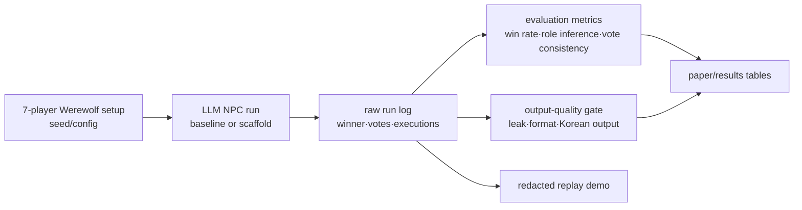

[한국어](README.md) | **English**

# Can an AI Taught the Humanities Reason Better in a Game of Deception?
> An exploratory study that applies a humanities-grounded interdisciplinary scaffold to a 7-player Werewolf game and evaluates LLM NPC social-reasoning behavior with a seed-controlled harness and output-quality gates.


[](https://ljhljh0703-cmd.github.io/ai-npc-social-reasoning-harness/)

The paper is provided in separate Korean and English versions.

| Document | Link | Use |
|---|---|---|
| Korean paper | [docs/paper-ko.md](docs/paper-ko.md) | Final Korean paper-style text |
| English paper | [docs/paper-en.md](docs/paper-en.md) | Final English paper candidate |
| Final report | [docs/final-report.md](docs/final-report.md) | Korean submission-oriented report |
| Results tables | [docs/results-tables.md](docs/results-tables.md) | RT2/RT2.2/RT2.3 results and claim gates |
| Bibliography | [docs/references.bib](docs/references.bib) | Public BibTeX |

## Problem Definition

LLM NPCs can produce plausible dialogue, but that does not prove the dialogue is grounded in social reasoning. This project uses a 7-player Werewolf game as an incomplete-information social-reasoning environment and separates fluent dialogue from measurable voting, execution, and win-condition behavior.

The project is directly motivated by Xu et al.'s Werewolf LLM study. That work implements a seven-player Werewolf game as a natural-language communication game and combines frozen LLMs with communication retrieval, reflection, and experience-based suggestions, observing strategic behaviors such as trust, confrontation, camouflage, and leadership. This project extends that motivation with a humanities-grounded scaffold, seed-controlled comparison, explicit raw/display separation, and output-quality gates.

## Key Terms for Non-Specialists

| Term | Meaning in this project |
|---|---|
| Harness | A testing rig that runs experiments under comparable conditions and records the results. Here it bundles seeds, role setup, run logs, metrics, and quality gates. |
| Scaffold | A reasoning support frame, not an answer key. It nudges NPCs to track utterance analysis, public-opinion flow, beneficiary analysis, and interrogation strategy. |
| Raw/display boundary | Raw experiment logs are separated from presentation-facing text and visuals. Performance claims are made from raw results only. |
| Claim gate | A threshold that prevents overstating weak results. This project did not pass the strong claim gate, so the result is reported as an exploratory trend. |

## Core Differentiators

- **Humanities-grounded interdisciplinary scaffold** — Structures utterance analysis, public-opinion analysis, beneficiary analysis, and interrogation strategy as a public reasoning frame for NPCs.
- **Seed-controlled Werewolf evaluation harness** — Compares baseline and scaffold arms under the same seeds and the same 7-player role setup.
- **Prompt-effect verification focus** — Treats the main artifact as a harness for repeatedly testing whether prompts or scaffolds change behavior, rather than as a more elaborate prompt recipe.
- **Raw/display boundary and claim gate** — Separates raw performance metrics from display-level sanitized artifacts and withholds strong performance claims because the strong gate was not passed.

## Current Stage and Next Stage

The current contribution is **evaluation harness construction plus scaffold exploration**. The result does not prove that an AI taught the humanities generally reasons better. It is an early controlled test of whether a scaffold can weakly shift observable behavior while output quality is held constant.

The next research stage should proceed as follows.

1. Run paired seed-level analysis to identify where baseline and scaffold trajectories diverge.
2. Add independent human annotation for contradiction detection, suspicion transfer, follow-up quality, and beneficiary reasoning.
3. Record belief-state tables for “who is assumed to know what” to strengthen theory-of-mind proxies.
4. Directly compare Xu-style retrieval/reflection/experience conditions against the humanities scaffold.
5. Replicate across multiple LLMs and larger N to test whether the current exploratory trend survives.

## Architecture



Summary flow: the game is fixed by seed/config, LLM NPC runs are stored, and raw performance metrics are separated from output-quality metrics before being used in papers, reports, and demos.

## Tech Stack

| Area | Use |
|---|---|
| Experiment model | `llama3.1:8b` |
| Experiment harness | Python, seed/config/run JSON, rule-based metrics |
| Game environment | 7-player Werewolf: 2 wolves, 2 villagers, 1 prophet, 1 guard, 1 witch |
| Evaluation metrics | Village win rate, role inference, vote consistency, average duration, raw quality pass, replacements |
| Demo | HTML, Phaser 3, DOM HUD, redacted replay payload |
| Public package | GitHub Pages, public-safe docs, redacted source boundary |

## Run

The static demo and presentation can be viewed with a local HTTP server.

```bash
python3 -m http.server 5217
```

Open in a browser:

```text
http://127.0.0.1:5217/
http://127.0.0.1:5217/demo/
http://127.0.0.1:5217/presentation/
```

For the reproducibility boundary, see [repro/run-manifest.md](repro/run-manifest.md) and [repro/colab-instructions.md](repro/colab-instructions.md).

## Honesty and Limits

- **[exploratory study]** — The final RT2.3 N=20 result showed positive directional trends under output-quality control, not statistical proof or general superiority.
- **[not yet measured]** — Larger N, multi-model replication, and independent human annotation have not yet been performed.
- **public export boundary** — Original raw/display JSON archives and internal session logs are not included in this public export.
- **redacted replay** — The browser demo is an explanatory representative replay. Performance interpretation uses the RT2.3 N=20 result table.
- **STEP7-O auxiliary smoke** — It passed quality and utterance-diversity gates, but it is not evidence of performance improvement and is not merged into the main result table.
- **clean-room** — The public export excludes local absolute paths, API keys, internal progress logs, and direct downloads of original archives.

## Screenshots / Demo

- Project page: <https://ljhljh0703-cmd.github.io/ai-npc-social-reasoning-harness/>
- Browser demo: [demo/](demo/)
- HTML presentation: [presentation/](presentation/)
- Reproducibility manifest: [repro/run-manifest.md](repro/run-manifest.md)

## License

This public export uses a split license.

- Code: MIT License. See [LICENSE-CODE-MIT.md](LICENSE-CODE-MIT.md).
- Reports, presentation text, documentation, and visual/demo assets: Creative Commons Attribution-NonCommercial 4.0 International. See [LICENSE-DOCS-ASSETS-CC-BY-NC-4.0.md](LICENSE-DOCS-ASSETS-CC-BY-NC-4.0.md).

Repository-level summary: [LICENSE](LICENSE).
