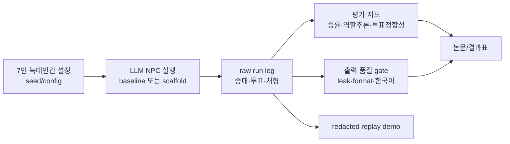

**한국어** | [English](README.en.md)

# 인문학을 학습한 AI는 늑대인간 게임에서 더 잘 추리할까
> 인문학 기반 학제적 스캐폴드를 7인 늑대인간 게임에 적용하고, LLM NPC의 사회추론 행동을 시드 고정 하네스와 출력 품질 gate로 검증한 탐색 연구.


[](https://ljhljh0703-cmd.github.io/ai-npc-social-reasoning-harness/)

논문은 국문/영문을 분리해 제공한다.

| 문서 | 링크 | 용도 |
|---|---|---|
| 국문 논문 | [docs/paper-ko.md](docs/paper-ko.md) | 최종 국문 논문형 본문 |
| English paper | [docs/paper-en.md](docs/paper-en.md) | Final English paper candidate |
| 최종보고서 | [docs/final-report.md](docs/final-report.md) | 제출용 한국어 보고서 |
| 결과표 | [docs/results-tables.md](docs/results-tables.md) | RT2/RT2.2/RT2.3 결과와 claim gate |
| 참고문헌 | [docs/references.bib](docs/references.bib) | 공개 BibTeX |

## 문제 정의

LLM NPC는 자연스러운 대화를 생성할 수 있지만, 그 발화가 실제 사회추론에 기반한 것인지는 별도로 검증해야 한다. 이 프로젝트는 7인 늑대인간 게임을 불완전정보 사회추론 환경으로 사용해, 발화의 그럴듯함과 실제 투표·처형·승패 지표를 분리해 측정했다.

직접적인 문제의식은 Xu 등(2023/2024)의 Werewolf LLM 연구에서 출발했다. 해당 연구는 7인 늑대인간을 자연어 커뮤니케이션 게임으로 구현하고, 동결 LLM에 과거 대화 retrieval, reflection, experience 기반 suggestion을 결합해 trust, confrontation, camouflage, leadership 같은 전략 행동이 관찰될 수 있음을 보였다. 본 프로젝트는 이 문제의식을 이어받되, 인문학 기반 스캐폴드, seed 고정 비교, raw/display 경계, 출력 품질 gate를 더 명시적으로 분리해 평가한다.

## 비전문가용 핵심 용어

| 용어 | 이 프로젝트에서의 뜻 |
|---|---|
| 하네스 | 실험을 같은 조건에서 반복 실행하고 결과를 기록하는 검사대다. 여기서는 seed, 역할 구성, run log, 평가 지표, 품질 gate를 묶어 LLM NPC를 비교 가능하게 만든다. |
| 스캐폴드 | 정답을 알려주는 장치가 아니라, NPC가 발화 분석, 여론 분석, 수혜자 분석, 심문 전략을 놓치지 않도록 주는 사고 보조 틀이다. |
| raw/display 경계 | 원본 실험 로그(raw)와 발표용으로 정리한 화면/문장(display)을 분리한다는 뜻이다. 성능 판단은 raw에서만 한다. |
| claim gate | 결과가 약할 때 강한 주장을 하지 못하게 막는 기준이다. 이번 결과는 strong claim gate를 넘지 못했으므로 탐색적 경향으로만 보고한다. |

## 핵심 차별축

- **인문학 기반 학제적 스캐폴드** — 발화 분석, 여론 분석, 수혜자 분석, 심문 전략을 NPC의 공개 추론 frame으로 구조화했다.
- **시드 고정 늑대인간 평가 하네스** — 같은 seed와 같은 7인 역할 구성에서 baseline과 scaffold arm을 비교했다.
- **프롬프트 효과 검증 중심** — 더 정교한 prompt 자체보다, prompt나 scaffold가 실제 행동 지표를 바꾸는지 반복 검증할 수 있는 하네스를 중심 산출물로 둔다.
- **raw/display 경계와 claim gate** — 원본 성능 지표와 표시용 sanitized 산출물을 분리하고, 강한 성능 claim은 gate 미통과로 보류했다.

## 현재 단계와 다음 스테이지

현재 단계는 **평가 하네스 구축 + 스캐폴드 탐색 연구**다. 본 결과는 “인문학을 학습한 AI가 일반적으로 더 잘 추리한다”는 확정 결론이 아니라, 출력 품질을 통제한 상태에서 스캐폴드가 관찰 가능한 행동 지표를 약하게 바꾸는지 본 예비 검증이다.

다음 스테이지는 다음 순서로 이어간다.

1. 같은 seed의 baseline/scaffold run을 짝지어 어디서 판단이 갈라졌는지 분석한다.
2. 모순 감지, 의혹 전이, follow-up, 수혜자 분석에 독립 human annotation을 붙인다.
3. “누가 무엇을 알고 있다고 추정했는가”를 belief-state table로 기록해 마음이론 proxy를 강화한다.
4. Xu 등 연구의 retrieval/reflection/experience 조건과 humanities scaffold 조건을 직접 비교한다.
5. 여러 LLM과 더 큰 N에서 재현해 현재의 탐색적 경향이 유지되는지 확인한다.

## 아키텍처



요약 흐름: seed/config로 게임을 고정하고, LLM NPC run을 저장한 뒤, raw 성능 지표와 출력 품질 지표를 분리해 논문·리포트·데모로 연결한다.

## 기술 스택

| 영역 | 사용 |
|---|---|
| 실험 모델 | `llama3.1:8b` |
| 실험 하네스 | Python, seed/config/run JSON, rule-based metrics |
| 게임 환경 | 7인 늑대인간: 늑대 2, 시민 2, 예언자 1, 가드 1, 마녀 1 |
| 평가 지표 | 마을승률, 역할추론, 투표정합성, 평균 지속일, raw 품질통과, replacements |
| 데모 | HTML, Phaser 3, DOM HUD, redacted replay payload |
| 공개 패키지 | GitHub Pages, public-safe docs, redacted source boundary |

## 실행법

정적 데모와 발표자료는 별도 빌드 없이 로컬 HTTP 서버로 확인할 수 있다.

```bash
python3 -m http.server 5217
```

브라우저에서 연다.

```text
http://127.0.0.1:5217/
http://127.0.0.1:5217/demo/
http://127.0.0.1:5217/presentation/
```

실험 재현 경계는 [repro/run-manifest.md](repro/run-manifest.md)와 [repro/colab-instructions.md](repro/colab-instructions.md)를 기준으로 본다.

## 정직 · 한계

- **[탐색 연구]** — 최종 RT2.3 N=20은 품질 통제 상태의 양의 방향을 보였지만, 통계적 확증이나 일반적 우월성 주장이 아니다.
- **[측정전]** — 더 큰 N, 다중 모델, 독립 human annotation은 아직 수행하지 않았다.
- **공개본 경계** — 원본 raw/display JSON archive와 내부 세션 로그는 public export에 포함하지 않는다.
- **redacted replay** — 브라우저 데모는 설명용 대표 replay이며, 성능 근거는 RT2.3 N=20 결과표다.
- **STEP7-O 보조 smoke** — 품질 gate와 발화 다양성은 통과했지만, 성능 개선 근거가 아니며 메인 결과표에 병합하지 않는다.
- **clean-room** — 공개본은 로컬 절대경로, API key, 내부 진행 로그, 원본 archive 직접 다운로드를 제외했다.

## 스크린샷 / 데모

- Project page: <https://ljhljh0703-cmd.github.io/ai-npc-social-reasoning-harness/>
- Browser demo: [demo/](demo/)
- HTML presentation: [presentation/](presentation/)
- Reproducibility manifest: [repro/run-manifest.md](repro/run-manifest.md)

## License

이 공개 export는 분리 라이선스를 사용한다.

- Code: MIT License. See [LICENSE-CODE-MIT.md](LICENSE-CODE-MIT.md).
- Reports, presentation text, documentation, and visual/demo assets: Creative Commons Attribution-NonCommercial 4.0 International. See [LICENSE-DOCS-ASSETS-CC-BY-NC-4.0.md](LICENSE-DOCS-ASSETS-CC-BY-NC-4.0.md).

Repository-level summary: [LICENSE](LICENSE).
