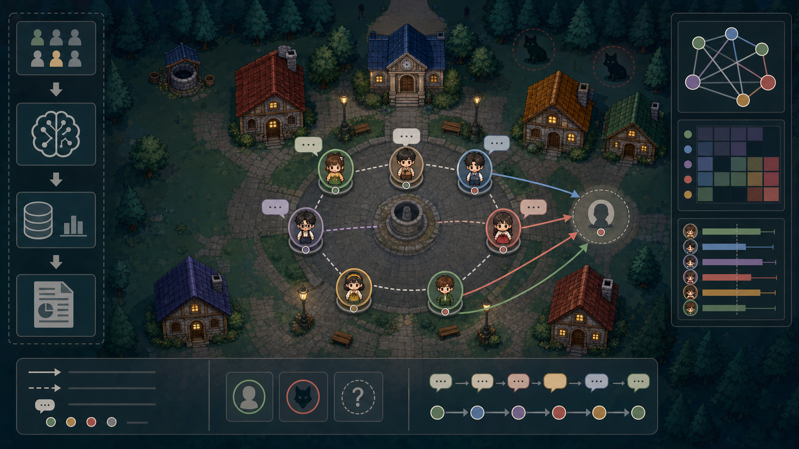
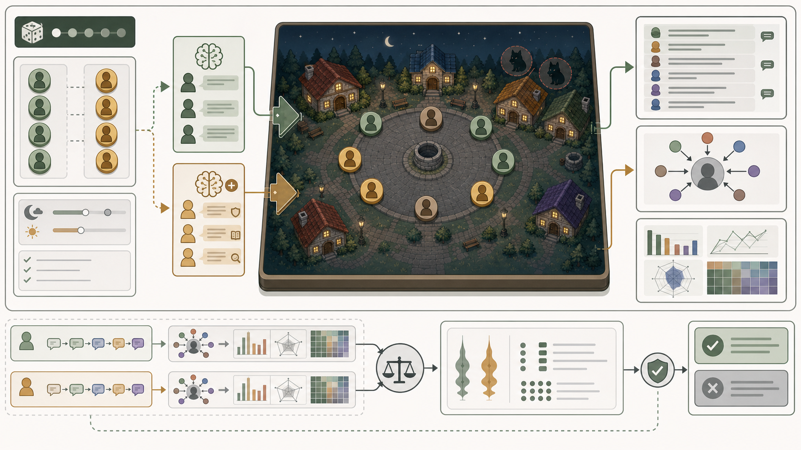
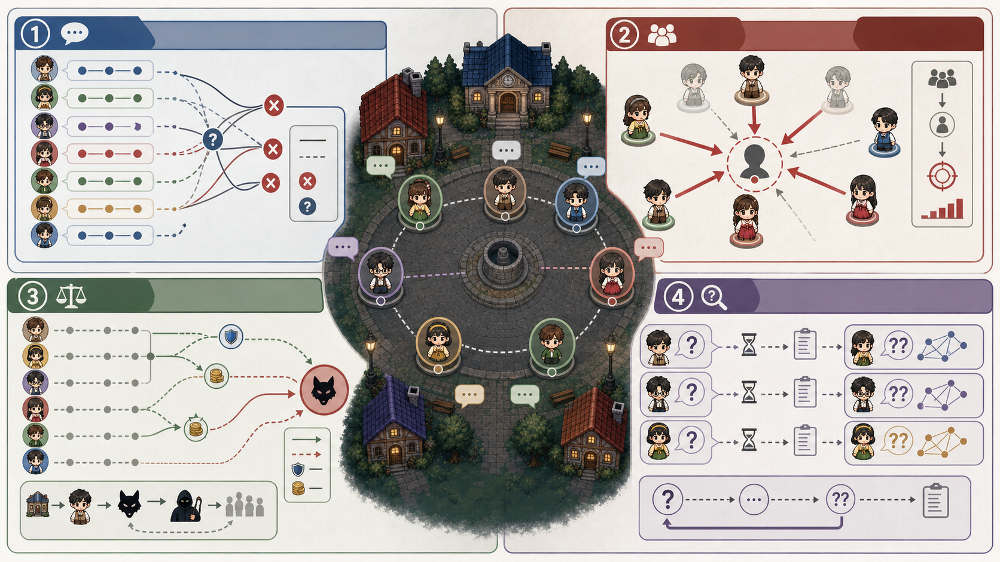
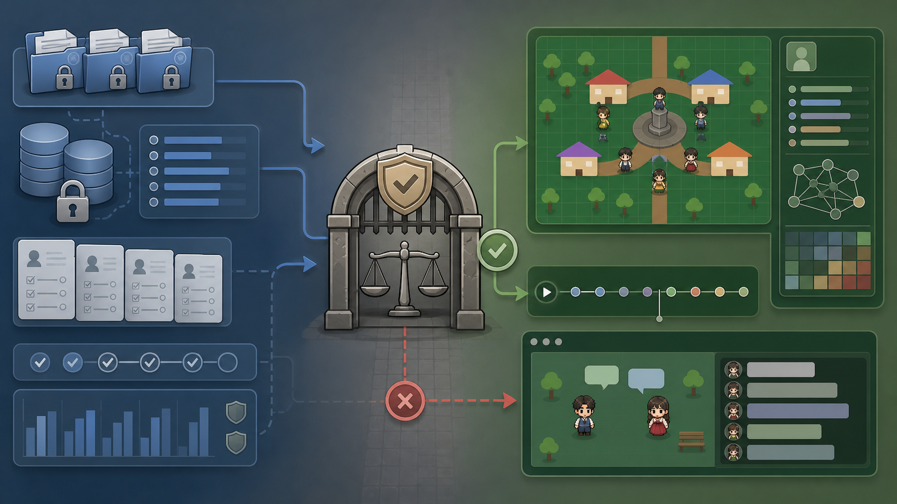

# 인문학을 학습한 AI는 늑대인간 게임에서 더 잘 추리할까

**인문학 기반 학제적 스캐폴드 · 시드 고정 늑대인간 평가 하네스 · 출력 품질을 통제한 탐색 연구**

작성일: 2026-06-29  
상태: 공개 논문 후보  
기준 실험: STEP7-M RT2.3 N=20

## 초록

대규모 언어 모델 기반 NPC는 자연스러운 사회적 대화를 생성할 수 있다. 그러나 발화의 자연스러움만으로 숨은 역할, 기만, 공개 토론, 집단 투표 상황에서 에이전트가 추론을 수행했다고 볼 수는 없다. 본 논문은 LLM NPC의 관찰 가능한 사회추론 행동을 평가하기 위한 통제된 7인 늑대인간 게임 하네스를 제시한다. 하네스는 원본 게임 성능 지표와 표시 계층의 출력 위생을 분리하고, baseline full architecture와 마을 진영 학제적 스캐폴드를 비교한다. 스캐폴드는 발화 분석, 여론 분석, 수혜자 분석, 심문 전략이라는 네 가지 인간이 읽을 수 있는 추론 frame을 조작화한다. 최종 STEP7-M RT2.3 N=20 비교에서 scaffold arm은 raw 품질통과 20/20과 replacements 0을 유지하면서 마을승률 +0.100, 역할추론 +0.066, 투표정합성 +0.019, 평균 지속일 +0.150의 작은 양의 방향을 보였다. 역할추론 delta는 사전 정의한 +0.10 strong-claim gate에 도달하지 못했다. 따라서 본 결과는 통계적 확증이나 일반적 사회추론 우월성이 아니라, 출력 품질 통제 상태에서 관찰된 탐색적 양의 경향으로 해석한다. 본 논문의 기여는 통제된 사회추론 실행, raw/display 경계, 보수적 claim gate, 학제적 사회추론 스캐폴드의 구성개념 타당도 경계를 함께 제시한 평가 framing에 있다.

## 키워드

LLM NPC, 사회추론, 늑대인간, 마피아 게임, 사회추론 게임, 불완전정보, 에이전트 평가, 스캐폴딩, 출력 품질 통제

## 1. 서론

LLM 기반 NPC는 실제 의사결정이 약해도 사회적으로 풍부한 대화를 생성하는 것처럼 보일 수 있다. 이 차이는 숨은 역할 게임에서 중요하다. 유능한 늑대인간 플레이어는 이전 발화를 기억하고, 모순을 감지하고, 부분 정보 아래에서 의심을 갱신하고, 성급한 합의를 경계하며, 특정 투표가 마을이나 늑대 진영 중 누구에게 이익이 되는지 판단해야 한다. transcript가 그럴듯해 보여도, 에이전트가 자신의 증거와 어긋나는 투표를 하거나 무고한 대상에 대한 의혹 확산을 돕는다면 사회추론 성능을 주장하기 어렵다.

본 논문은 이 간극을 통제된 7인 늑대인간 하네스로 다룬다. 늑대인간 게임은 비대칭 정보, 공개 발화, 기만, 역할별 지식, 집단 투표를 결합한다. 이러한 속성은 사회적 대화를 감사 가능한 행동 결과로 바꾼다. 누가 의심받았는지, 누구에게 투표했는지, 처형된 대상이 실제 늑대였는지, 최종적으로 마을이 승리했는지를 기록할 수 있다.

연구 질문은 다음과 같다.

> 학제적 마을 진영 스캐폴드는 고정된 늑대인간 게임 하네스에서 출력 품질 통제를 유지하면서 LLM NPC의 관찰 가능한 사회추론 행동을 바꾸는가?

본 논문의 답은 보수적이다. 최종 RT2.3 결과는 출력 품질 통제 이후 작은 양의 delta를 보였지만, 강한 성능 claim을 지지하지는 않는다. 따라서 본 논문은 발화 품질, 원본 게임 행동, 사회추론 구성개념 해석을 분리하는 제한된 평가 방법을 기여로 둔다.

본 논문의 기여는 세 가지다.

1. 숨은 역할, 토론, 투표, 승패 판정을 포함하는 seed 통제 늑대인간 하네스를 제시한다.
2. 정제된 공개 문구가 원본 성능 근거로 오해되지 않도록 raw/display 경계를 분리한다.
3. 네 축의 학제적 스캐폴드를 내부 인간형 인지의 증거가 아니라 관찰 가능한 proxy 지표로 연결한다.

### 1.1 시각 개요

아래 그림들은 논문 이해를 돕기 위한 개념도다. 실험 데이터 자체를 시각화한 결과표가 아니며, 성능 판단은 5장의 RT2.3 N=20 표를 기준으로 한다.



**그림 1. 늑대인간 사회추론 하네스 개념도.** 7인 늑대인간 환경에서 공개 발화, 숨은 역할, 의혹 이동, 투표, 결과 지표가 하나의 평가 하네스로 연결되는 구조를 표현한다.



**그림 2. Seed 고정 baseline/scaffold 비교 개념도.** 같은 seed와 같은 게임 조건에서 baseline arm과 scaffold arm을 실행하고, 결과를 raw 로그와 지표로 분리해 비교하는 흐름을 표현한다.



**그림 3. 네 축 스캐폴드 개념도.** 발화 분석, 여론 분석, 수혜자 분석, 심문 전략이라는 네 축을 사회추론 게임의 관찰 가능한 단서에 연결한 개념도다.



**그림 4. Raw/display 경계와 claim gate 개념도.** 원본 실험 근거와 발표용 display replay를 분리하고, 보수적 claim gate를 거쳐 허용 가능한 주장만 남기는 절차를 표현한다.

## 2. 관련연구

LLM 에이전트 연구는 언어 모델을 정적 텍스트 생성기가 아니라 상호작용 환경 안에 배치할 수 있음을 보여줬다. Generative Agents는 memory, reflection, planning, interaction이 결합된 개방형 사회 시뮬레이션을 제시했다 [@park2023generativeagents]. Voyager는 환경 기반 탐색과 누적 skill 관점에서 LLM 에이전트를 다룬다 [@wang2023voyager]. 본 연구는 고정된 적대적 사회추론 과제를 사용한다는 점에서 다르다. 여기서는 대화의 그럴듯함만으로 충분하지 않고, 에이전트는 불완전정보 아래에서 감사 가능한 투표 결정을 내려야 한다.

에이전트 평가 연구는 텍스트 품질보다 task behavior를 봐야 한다는 방향을 제공한다. AgentBench는 상호작용 환경에서 LLM을 에이전트로 평가한다 [@liu2023agentbench]. AgentBoard는 최종 성공뿐 아니라 multi-turn 과정 분석을 강조한다 [@ma2024agentboard]. 본 논문도 이 흐름에 따라 승률, 역할추론, 투표정합성, 출력 품질 gate, replay 경계를 서로 다른 근거 흐름으로 분리해 보고한다.

사회추론 게임은 LLM의 사회적 행동을 압축적으로 검토할 수 있는 환경이다. 선행 연구는 Werewolf 또는 유사 사회추론 게임을 사용해 LLM의 커뮤니케이션, 기만 관련 행동, 사회추론 전략을 평가했다 [@bailis2024werewolfarena; @xu2023werewolfllm; @song2025beyondsurvival]. 본 논문의 기여는 단순한 게임 플레이 결과가 아니라, raw 성능, 표시 위생, 구성개념 타당도를 구분하는 claim-gated harness에 있다.

본 연구의 더 직접적인 출발점은 Xu 등(2023/2024)의 Werewolf LLM 연구다. 해당 연구는 7인 늑대인간을 자연어 커뮤니케이션 게임으로 구현하고, 동결 LLM에 과거 대화 retrieval, reflection, experience 기반 suggestion을 결합해 trust, confrontation, camouflage, leadership 같은 전략 행동이 관찰될 수 있음을 보였다 [@xu2023werewolfllm]. 본 연구는 이 문제의식에서 직접적인 영감을 받았다. 다만 본 연구는 experience pool 자체를 확장하는 대신, 인문학 기반 스캐폴드와 seed 고정 비교, raw/display 경계, 출력 품질 gate를 전면에 둔다.

추론 스캐폴드 연구도 본 연구의 배경이다. Chain-of-thought prompting은 구조화된 중간 추론이 일부 추론 과제의 성능을 높일 수 있음을 보였다 [@wei2022chain]. ReAct는 reasoning과 action을 결합해 상호작용 행동을 구성한다 [@yao2023react]. Reflexion은 language agent의 언어적 자기반성을 다룬다 [@shinn2023reflexion]. 본 연구의 스캐폴드는 더 좁다. 공개 대화에 private chain-of-thought를 노출하지 않고, 숨은 정답도 제공하지 않는다. 대신 공개 사회적 단서, 즉 발화, 여론 흐름, 수혜자, 후속 질문에 주의를 구조화한다.

사회심리학과 게임이론은 해석 어휘를 제공한다. 동조 연구는 공개 동의 압력을 관찰해야 하는 이유를 제공한다 [@asch1956conformity]. Groupthink와 group polarization은 성급한 합의와 의혹 집중을 주의해야 하는 배경을 제공한다 [@janis1972groupthink; @myers1976grouppolarization]. Cheap talk 이론은 숨은 역할 게임의 공개 발화를 전략적이고 신뢰 불완전한 정보로 다루는 이유를 제공한다 [@crawford1982strategic]. 이 문헌들은 proxy 설계의 배경으로만 사용되며, LLM NPC가 인간 심리 상태를 가진다는 증거로 사용하지 않는다.

## 3. 방법

### 3.1 환경

본 연구는 고정된 7인 늑대인간 게임에서 LLM NPC 행동을 평가한다. 각 run은 늑대 2명, 시민 2명, 예언자 1명, 가드 1명, 마녀 1명으로 구성된다. 완결된 run에는 역할 배정, 밤 행동, 낮 토론, 공개 투표, 처형, 사망 처리, 최종 승패 판정이 포함된다. 이 과제는 의도적으로 불완전정보 구조를 가진다. 마을 진영 에이전트는 공개 발화와 visible outcome만으로 추론해야 하며, 숨은 역할 에이전트는 모호성이나 의혹 전이를 통해 이익을 얻을 수 있다.

기준 실험은 STEP7-M RT2.3이다. 모델은 `llama3.1:8b`, 비교 arm은 `full-step7m-rt23`와 `full-village-scaffold-step7m-rt23`, 각 arm의 반복 수는 N=20이다. seed 58은 발표와 정성 설명을 위한 대표 replay로만 사용한다. aggregate 근거로 사용하지 않는다.

### 3.2 조건

baseline arm인 `full-step7m-rt23`는 최종 마을 진영 스캐폴드가 없는 full architecture다. scaffold arm인 `full-village-scaffold-step7m-rt23`는 발화 분석, 여론 분석, 수혜자 분석, 심문 전략으로 구성된 구조화된 마을 진영 추론 frame을 추가한다. 이 스캐폴드는 숨은 역할이나 정답을 공개하지 않는다. 공개 단서, 의혹 흐름, 전략적 이익, 후속 질문을 추적하도록 attention structure를 바꾸는 조건이다.

### 3.3 Raw와 Display 경계

하네스는 raw 게임 성능 근거와 display-level 출력 위생을 분리한다. raw 성능 지표는 원본 run의 승패, 처형 대상, 개별 투표, 게임 지속일에서 계산한다. sanitized display artifact는 공개 발표와 demo 안전성을 위해 사용한다. sanitized 결과는 raw 성능 지표를 재계산하거나 대체하지 않는다.

품질 gate는 원본 run이 출력 위생 검사를 통과했는지, 표시 계층에서 replacement가 필요했는지를 기록한다. RT2.3 N=20에서 두 arm은 모두 raw quality 20/20, replacements 0을 기록했다. 이는 비교에서 출력 품질이 통제됐다는 뜻이지, 그 자체가 추론 성능 개선의 증거는 아니다.

### 3.4 지표

마을승률은 마을 진영이 승리한 run의 비율이다.

```text
village_win_rate = village_wins / total_runs
```

역할추론은 처형 결과의 정확도로 측정한다.

```text
role_inference = correct_wolf_executions / total_executions
```

투표정합성은 개별 투표가 실제 늑대를 향했는지의 비율이다.

```text
vote_consistency = votes_against_wolves / total_votes
```

평균 지속일은 run별 게임 지속일의 평균이다.

```text
average_duration = sum(days_per_run) / total_runs
```

raw 품질통과는 원본 run이 출력 위생 gate를 통과한 수다. replacements는 공개 표시를 위해 필요한 표시 계층 치환 횟수다.

모든 성능 지표는 행동 proxy다. 이 지표는 관찰 가능한 게임 결과와 투표 행동을 측정하며, 모델의 내부 인지 상태를 직접 측정하지 않는다.

### 3.5 공개 산출물 경계

공개 export에는 국문/영문 논문, 최종 보고서, 결과표, redacted replay payload, artifact hash가 포함된 run manifest가 포함된다. 완전한 원본 raw/display JSON archive는 public repository에 포함하지 않는다. 따라서 공개 패키지는 보고된 결과와 replay 행동의 점검을 지원하지만, 비공개 raw archive로부터의 완전 독립 재현까지 제공하지는 않는다.

## 4. 스캐폴드 설계와 구성개념 타당도

네 축 스캐폴드는 인간 심리 모형이 아니라, 사회추론 게임 행동을 조작적으로 관찰하기 위한 frame이다. 관련 구성개념은 “인간형 인지”가 아니라 숨은 역할, 공개 토론, 투표 압력 아래에서 나타나는 관찰 가능한 사회추론 행동이다.

| 스캐폴드 축 | 조작적 정의 | 관찰 가능한 proxy | 잘못된 해석 |
|---|---|---|---|
| 발화 분석 | 공개 발화 사이의 모순, 회피, 과도한 확신, 서사 일관성 붕괴를 추적한다. | contradiction label, evasion label, repeated target mention, accusation shift | 모델이 인간과 같은 방식으로 모순을 이해했다. |
| 여론 분석 | 의심이 플레이어 사이에서 어떻게 이동하는지, 공개 동의가 지나치게 빠르게 집중되는지 추적한다. | bandwagon vote, rapid agreement, accusation concentration, non-wolf focus persistence | 에이전트가 인간 동조나 집단 극화를 보였다. |
| 수혜자 분석 | 특정 처형, 침묵, 의혹 전이에서 어떤 플레이어 또는 역할 집단이 이익을 얻는지 묻는다. | wolf-benefiting vote, non-wolf execution with wolf participation, beneficiary label | run이 formal game-theoretic equilibrium을 구현했다. |
| 심문 전략 | 즉시 확신하기보다 질문, 판단 유예, 후속 확인을 유도한다. | question count, deferred vote label, follow-up after clue, targeted pressure | 모델이 인간 수준의 심문 능력을 가졌다. |

이 proxy들은 의도적으로 보수적이다. 공개 발화, 대상 언급, 투표 선택, 처형 결과, 최종 승패처럼 관찰 가능한 artifact만 사용한다. conformity pressure, scapegoating, cognitive inertia 같은 용어는 분석 label로만 사용한다. “scapegoating” label은 공개 의혹 흐름 속에서 비늑대에게 의심이나 처형이 집중됐다는 뜻이다. 사회심리학적 희생양 메커니즘을 모델이 재현했다는 뜻이 아니다. “cognitive inertia” label은 관련 반증 단서 이후에도 의심이 유지됐다는 뜻이지, 내부 belief state를 측정했다는 뜻이 아니다.

## 5. 결과

### 5.1 개발 흐름

최종 결과는 세 실험 단계를 거쳐 해석해야 한다. RT2에서는 일부 게임 지표에서 강한 양의 이동이 관찰됐지만, 동시에 큰 출력 품질 비용이 발생했다. scaffold arm의 raw 품질통과는 10/20이었고 replacements는 26이었다. RT2.2에서는 더 강한 prompt-level 억제를 시도했지만, 평가 흐름이 불안정해져 최종 후보에서 제외했다. RT2.3은 추론 스캐폴드를 유지하면서 공개 출력 위생을 별도 runtime layer로 분리했다.

따라서 최종 후보는 두 arm 모두 raw 품질 gate를 통과하고 replacement가 없었던 RT2.3 N=20이다.

### 5.2 최종 RT2.3 N=20 비교

| arm | N | 마을승률 | 늑대승률 | 역할추론 평균±SD | 투표정합성 평균±SD | 평균 지속일±SD | raw 품질통과 | replacements |
|---|---:|---:|---:|---:|---:|---:|---:|---:|
| `full-step7m-rt23` | 20 | 0.200 | 0.800 | 0.317±0.404 | 0.334±0.257 | 2.000±0.649 | 20/20 | 0 |
| `full-village-scaffold-step7m-rt23` | 20 | 0.300 | 0.700 | 0.383±0.383 | 0.353±0.216 | 2.150±0.671 | 20/20 | 0 |
| delta | - | +0.100 | -0.100 | +0.066 | +0.019 | +0.150 | +0 | +0 |

scaffold arm은 모든 보고 지표에서 양의 방향을 보였다. 마을승률은 +0.100, 역할추론은 +0.066, 투표정합성은 +0.019, 평균 지속일은 +0.150일 증가했다. 두 arm 모두 raw 품질통과 20/20, replacements 0이므로, 초기 단계에서 관찰됐던 출력 품질 실패가 최종 비교를 직접 교란하지 않는다.

### 5.3 효과크기와 불확실성

관찰된 효과는 작다. 마을승률 delta는 baseline 4/20 대 scaffold 6/20의 차이에 해당하며, 대략적 불확실성 구간은 0을 포함한다. 역할추론의 근사 표준화 효과크기는 d≈0.17, 투표정합성은 d≈0.08, 평균 지속일은 d≈0.23이다. 이 값들은 양의 방향성과는 양립하지만 강한 성능 결론과는 양립하지 않는다.

특히 역할추론 delta +0.066은 사전 정의한 +0.10 strong-claim gate에 도달하지 못했다. 따라서 본 결과는 탐색적으로 해석해야 한다.

### 5.4 대표 Seed 58

seed 58은 설명용 replay로 사용한다. scaffold arm에서 마을은 2일 만에 승리했고, role inference accuracy는 1.000, vote consistency는 0.750, 처형 2회는 모두 늑대 처형이었다. 같은 seed에서 baseline arm은 첫 처형에서 늑대를 잡았지만 이후 예언자를 처형해 늑대 승리로 끝났다.

이 replay는 스캐폴드가 한 개별 게임 흐름을 어떻게 바꿀 수 있는지 설명하는 데 유용하다. 그러나 aggregate 근거가 아니다. 성능 claim은 RT2.3 N=20 표에만 근거한다.

### 5.5 STEP7-O 보조 하네스 검증

STEP7-O는 메인 성능 실험이 아니라, 실제 LLM 발화 위에 verifier/sanitizer를 얹었을 때 출력 품질과 발화 다양성을 유지할 수 있는지 확인한 N=5 보조 smoke다. `llm_verify` 조건에서 run JSON 5개가 정상 생성됐고, 품질 gate의 scaffold leak, out-of-world, private-role leak candidate, thought leak, format leak, role-ability leak, overlong, non-Korean 항목은 모두 0이었다. 발화 다양성도 utterances 84, unique utterances 84, unique ratio 1.0으로 통과했다. sanitizer/verifier는 84개 발화를 확인했고 82개를 accept, 2개를 replace했다.

그러나 이 조건의 게임 성능은 낮았다. 늑대가 5/5 승리했고, 역할추론은 0.067±0.149, 투표정합성은 0.180±0.132였다. 따라서 STEP7-O는 scaffold 성능 개선 근거가 아니다. 이 결과는 “사회추론 성능 지표와 출력 품질 지표를 분리해서 통제해야 한다”는 방법론적 주장만 보강한다.

## 6. 논의

본 결과가 지지하는 문장은 제한적이다. 출력 품질 통제 상태에서 마을 진영 스캐폴드는 관찰 가능한 늑대인간 행동 지표에서 작은 양의 방향을 보였다. 이는 의미가 있다. 초기 변형에서는 스캐폴드 구조와 출력 위생 사이의 trade-off가 드러났고, RT2.3은 두 계층을 분리해 같은 표시 품질 교란 없이 스캐폴드를 평가할 수 있음을 보였다.

동시에 결과는 제한적이다. 스캐폴드는 사전 정의한 역할추론 gate를 넘지 못했다. 관찰된 delta는 작고, N=20은 강한 결론을 내리기에는 부족하다. 한 개의 replay는 개입이 실제보다 더 결정적으로 보이게 만들 수 있으므로, 대표 replay는 설명용으로만 남겨야 한다.

방법론적으로 중요한 점은 LLM NPC 평가에서 세 계층을 하나의 인상으로 합치지 않는 것이다. 그럴듯한 transcript는 성능 지표가 아니다. sanitized transcript는 raw 근거가 아니다. 심리학에서 영감을 받은 스캐폴드는 인간형 인지의 증거가 아니다. 본 하네스는 이 경계를 명시하고 검증 가능하게 만든다.

STEP7-O도 같은 결론을 보강한다. 품질 누출을 줄이고 발화 다양성을 유지하는 것은 가능했지만, 그 자체가 승률이나 역할추론 개선으로 이어지지는 않았다. 품질 통제는 성능 개선의 대체물이 아니라, 성능 지표를 해석하기 위한 전제 조건이다.

## 7. 한계

첫째, 표본 수는 탐색적이다. arm당 N=20은 경향과 실패 모드를 검토하는 데 유용하지만 강한 추론을 지지하지 않는다.

둘째, 본 연구는 하나의 모델 계열과 하나의 주된 게임 설정을 사용했다. 일반화를 위해서는 추가 LLM, 모델 크기, decoding 설정, rule variant가 필요하다.

셋째, 지표는 proxy다. 역할추론과 투표정합성은 감사 가능하지만 사회추론의 모든 형태를 포착하지는 못한다. 올바른 투표가 약한 이유로 발생할 수 있고, 좋은 추론이 투표를 바꾸지 못할 수도 있다.

넷째, 구성개념 타당도는 아직 불완전하다. 많은 label은 rule-based 또는 log-derived다. 더 강한 근거를 위해서는 모순, 회피, 공개 압력, follow-up 품질, 수혜자 추론에 대한 독립 human annotation이 필요하다.

다섯째, 공개 repository에는 완전한 raw archive가 포함되어 있지 않다. 이는 public project package로서는 수용 가능한 경계지만, 제3자가 raw record로부터 완전히 재현하는 데에는 한계가 있다.

여섯째, STEP7-O는 보조 하네스 검증이다. 품질 gate와 다양성 gate를 통과했지만, N=5 규모이고 게임 성능이 낮았으므로 주효과나 scaffold 성능 claim에 포함하지 않는다.

따라서 본 연구의 현재 위치는 “사회추론 성능을 해결한 모델”이 아니라 “사회추론 NPC를 반복 실행하고 보수적으로 평가하기 위한 하네스와 스캐폴드 탐색”이다. 이 경계를 넘는 주장은 본 결과로는 지지되지 않는다.

## 8. 다음 스테이지

후속 연구는 마음이론과 사회추론 claim을 강화하기 위해 다음 순서로 진행해야 한다.

첫째, paired seed 분석을 수행한다. 같은 seed에서 baseline과 scaffold run이 어느 낮 토론, 어느 투표, 어느 밤 행동 이후 갈라졌는지 비교해야 한다. 단순 평균 delta보다 이 분석이 실제 실패 모드와 개입 지점을 더 잘 보여준다.

둘째, 독립 human annotation을 도입한다. 현재의 발화 분석, 여론 분석, 수혜자 분석, 심문 전략 label은 대부분 rule-based 또는 log-derived proxy다. 다음 단계에서는 모순 감지, 논점 회피, 몰아가기, follow-up 품질, 수혜자 추론을 사람이 독립 라벨링하고, 모델 지표와 일치하는지 확인해야 한다.

셋째, 마음이론 proxy를 별도로 설계한다. “누가 무엇을 알고 있다고 추정했는가”, “어떤 플레이어가 어떤 믿음을 가진 것으로 모델이 다루었는가”, “새 단서 이후 그 믿음이 갱신됐는가”를 belief-state table로 기록해야 한다. 이것이 없으면 마음이론 해결 claim은 할 수 없다.

넷째, Xu 등 연구의 retrieval/reflection/experience 조건과 본 연구의 humanities scaffold 조건을 직접 비교한다. 후속 비교는 `baseline`, `retrieval/reflection/experience`, `humanities scaffold`, `combined` arm으로 나누어 어떤 구성요소가 실제 행동 지표를 바꾸는지 분해해야 한다.

다섯째, 다중 모델과 더 큰 N으로 재현한다. 최소 2개 이상의 LLM, 여러 decoding 설정, 더 큰 seed 집합에서 현재의 작은 양의 방향이 유지되는지 확인해야 한다. 이 단계 전까지는 일반적 우월성 claim을 보류한다.

## 9. 결론

본 논문은 LLM NPC의 관찰 가능한 사회추론 행동을 평가하기 위한 통제된 늑대인간 하네스를 제시했다. 하네스는 raw 게임 지표와 display-level 출력 위생을 분리하고, 학제적 마을 진영 스캐폴드에 보수적 claim gate를 적용했다. STEP7-M RT2.3 N=20에서 scaffold arm은 raw quality 20/20과 replacements 0을 유지하면서 승률, 역할추론, 투표정합성, 지속일에서 작은 양의 delta를 보였다. 이 근거는 탐색적이며 제한적이다. 더 중요한 기여는 방법론적이다. 본 연구는 유창한 대화, 정제된 표시, 측정된 추론을 혼동하지 않고 사회추론 NPC 행동을 평가하는 방식을 제시한다.

## 참고문헌

공개 참고문헌 BibTeX는 `docs/references.bib`에서 관리한다. 인용 항목 검증은 공개 export 전 내부 논문 작업실에서 수행했다.

- [@park2023generativeagents] Park et al. Generative Agents: Interactive Simulacra of Human Behavior.
- [@wang2023voyager] Wang et al. Voyager: An Open-Ended Embodied Agent with Large Language Models.
- [@liu2023agentbench] Liu et al. AgentBench: Evaluating LLMs as Agents.
- [@ma2024agentboard] Ma et al. AgentBoard: An Analytical Evaluation Board of Multi-turn LLM Agents.
- [@bailis2024werewolfarena] Bailis, Friedhoff, and Chen. Werewolf Arena: A Case Study in LLM Evaluation via Social Deduction.
- [@xu2023werewolfllm] Xu et al. Exploring Large Language Models for Communication Games: An Empirical Study on Werewolf.
- [@song2025beyondsurvival] Song et al. Beyond Survival: Evaluating LLMs in Social Deduction Games with Human-Aligned Strategies.
- [@wei2022chain] Wei et al. Chain-of-Thought Prompting Elicits Reasoning in Large Language Models.
- [@yao2023react] Yao et al. ReAct: Synergizing Reasoning and Acting in Language Models.
- [@shinn2023reflexion] Shinn et al. Reflexion: Language Agents with Verbal Reinforcement Learning.
- [@asch1956conformity] Asch. Studies of Independence and Conformity.
- [@janis1972groupthink] Janis. Victims of Groupthink.
- [@myers1976grouppolarization] Myers and Lamm. The Group Polarization Phenomenon.
- [@crawford1982strategic] Crawford and Sobel. Strategic Information Transmission.
